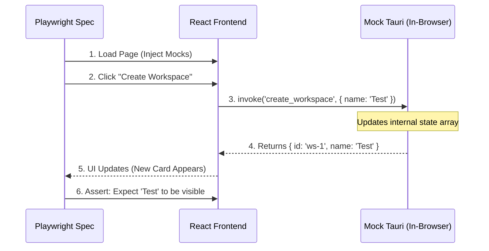

# Playwright E2E Testing Architecture (Web Mode)

This directory contains End-to-End (E2E) tests for the **Frontend Application (React)**, designed to run in a standard browser environment **without** requiring the Tauri (Rust) backend or Sidecars.

## 🚀 Concept: "Virtual Backend"

Since Playwright runs in a standard Chromium browser where Tauri APIs (`window.__TAURI__`) do not exist, we simulate the entire backend layer directly within the browser context.

### The Flow
1.  **Initialization**: Playwright launches the app (`pnpm dev`).
2.  **Injection**: `mocks/tauri.ts` injects a fake `window.__TAURI__` object before the app loads.
3.  **Interaction**: The test interacts with the UI using `data-testid` selectors.
4.  **Simulation**: When the UI calls `invoke('create_workspace')`, our **Stateful Mock** intercepts it, updates an internal in-memory "database", and returns a success response.
5.  **Verification**: The UI updates based on the mock response, and Playwright verifies the visual outcome.



## 🏗 Page Object Model (POM) Structure

To ensure maintainability and readability, we use the **Page Object Model** pattern. This separates the "how" (locators and interactions) from the "what" (test scenarios).

*   **`pages/`**: Contains the Page Object classes.
    *   `BasePage.ts`: Shared utilities and common interactions.
    *   `WorkspacePage.ts`: Logic for creating and navigating workspaces.
    *   `PdfPage.ts`: Interactions with the PDF viewer and search.
    *   `ChatPage.ts`: AI Chat interactions and multi-modal history verification.
    *   `FileManagerPage.ts`: Sidebar file operations (rename, delete).
    *   `AuthPage.ts`: Authentication state management.
*   **`test-data/`**: Centralized constants, mock responses, and test data sets.
*   **`mocks/`**: Stateful Tauri API simulations.
*   **`tests/`**: Clean test specs using Page Objects.

## 🛠 Key Components

*   **`playwright.config.ts`**: The orchestrator. Configures the test runner, base URL, and auto-starts the Vite dev server.
*   **`tests/e2e-web/mocks/tauri.ts`**: The "Brain". Intercepts `window.__TAURI__` calls and maintains an in-memory session state (workspaces, files) to simulate a real backend.
*   **`tests/e2e-web/tests/*.spec.ts`**: High-level test scenarios written using Page Objects.

## 💻 Usage

### Run All Tests
Executes all spec files in headless mode.
```bash
pnpm playwright test
```

### Run Specific Test File
```bash
pnpm playwright test tests/e2e-web/tests/workspace.spec.ts
```

### Show HTML Report
If tests fail, this opens automatically. To view the report for passed tests:
```bash
pnpm exec playwright show-report
```

### Run with UI Mode (Interactive Debugging)
Opens a visual runner to step through tests over time.
```bash
pnpm playwright test --ui
```
### Run with Debug Mode (Interactive Debugging)
Opens a visual runner to step through tests over time.
```bash
pnpm playwright test --debug
```
### Run with Headed Mode
Runs tests in a browser window with a visible UI.
```bash
pnpm playwright test --headed
``` 